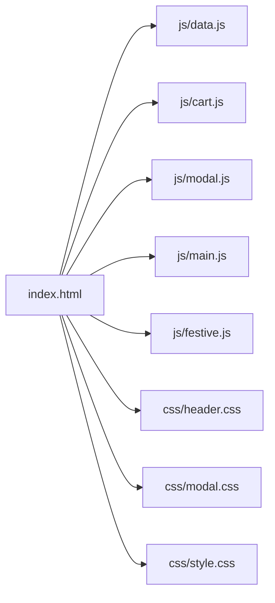
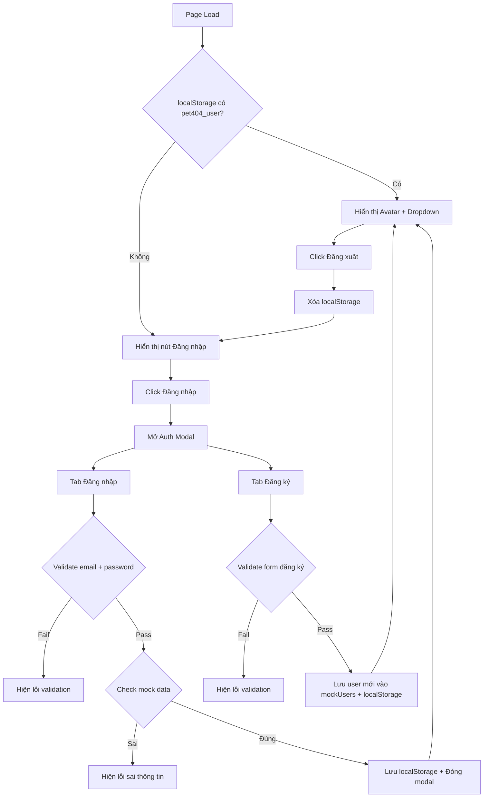

# Plan: Giả lập Login/Logout cho Pet404-Labs

## Tổng quan

Thêm chức năng **login/register/logout giả lập** (mock) vào website Pet404-Labs. Bao gồm:

- Modal đăng nhập / đăng ký với 2 tab chuyển đổi
- Validation cơ bản (email format, password length, confirm password match)
- Mock data check (so sánh với danh sách user giả lập)
- Lưu trạng thái đăng nhập vào `localStorage`
- Header UI thay đổi theo trạng thái: chưa đăng nhập → nút Login, đã đăng nhập → avatar + dropdown

## Kiến trúc hiện tại



### Trạng thái hiện tại

- Header luôn hiển thị avatar `NV` (hardcoded) với dropdown chứa thông tin user
- `mockUser` object trong `js/main.js` chứa data user cứng
- Nút Logout chỉ hiện notification, không thay đổi UI
- Không có form login/register

## Flow mới



## Chi tiết triển khai

### 1. File mới: `js/auth.js` — AuthManager Class

```javascript
class AuthManager {
  constructor() { ... }

  // Mock users database
  mockUsers = [
    { id: 1, name: 'Nguyễn Văn A', email: 'nguyenvana@pet404.vn', password: '123456', initials: 'NV', tier: 'Gold Member 🏆', orders: 12, points: 2450, wishlist: 5 },
    { id: 2, name: 'Trần Thị B', email: 'tranthib@pet404.vn', password: '123456', initials: 'TT', tier: 'Silver Member 🥈', orders: 5, points: 800, wishlist: 3 },
    { id: 3, name: 'admin', email: 'admin@pet404.vn', password: 'admin', initials: 'AD', tier: 'Admin 👑', orders: 0, points: 9999, wishlist: 0 }
  ]

  // Core methods
  login(email, password)        // Validate + check mock data → save to localStorage
  register(name, email, password) // Validate + add to mockUsers → auto login
  logout()                      // Clear localStorage → update UI
  getCurrentUser()              // Read from localStorage
  isLoggedIn()                  // Check localStorage

  // UI methods
  updateHeaderUI()              // Toggle header giữa logged-in / logged-out
  openAuthModal()               // Mở modal login/register
  closeAuthModal()              // Đóng modal
  switchTab(tab)                // Chuyển tab login ↔ register

  // Validation
  validateEmail(email)          // Regex check
  validatePassword(password)    // Min 6 chars
  showFieldError(field, msg)    // Hiện lỗi dưới field
  clearFieldErrors()            // Xóa tất cả lỗi
}
```

**localStorage key:** `pet404_user` — lưu JSON object user (không lưu password)

### 2. File mới: `css/auth.css` — Auth Modal Styles

Thiết kế theo design system hiện tại (dark theme, glassmorphism, emerald accent):

- `.auth-modal-overlay` — Overlay tương tự `.modal-overlay`
- `.auth-modal` — Modal container với max-width ~440px
- `.auth-tabs` — Tab bar Đăng nhập / Đăng ký
- `.auth-tab.active` — Active tab với emerald underline
- `.auth-form` — Form container
- `.auth-field` — Input group (label + input + error message)
- `.auth-input` — Styled input matching dark theme
- `.auth-input.error` — Red border khi validation fail
- `.auth-error` — Error message text
- `.auth-submit` — Submit button (emerald gradient)
- `.auth-footer` — Footer text với link chuyển tab
- `.auth-divider` — Divider "hoặc"
- `.auth-social` — Social login buttons (mock, chỉ UI)

### 3. Cập nhật `index.html`

#### a. Thêm Auth Modal HTML (trước closing `</body>`)

```html
<!-- Auth Modal -->
<div class="auth-modal-overlay" id="auth-modal">
  <div class="auth-modal">
    <button class="modal-close" id="auth-modal-close">
      <i class="bx bx-x"></i>
    </button>
    <div class="auth-header">
      <h2 class="auth-title">Chào mừng bạn!</h2>
      <p class="auth-subtitle">Đăng nhập để trải nghiệm tốt hơn</p>
    </div>
    <div class="auth-tabs">
      <button class="auth-tab active" data-tab="login">Đăng nhập</button>
      <button class="auth-tab" data-tab="register">Đăng ký</button>
    </div>
    <!-- Login Form -->
    <form class="auth-form" id="login-form">
      <div class="auth-field">
        <label>Email</label>
        <input type="email" id="login-email" placeholder="you@example.com" />
        <span class="auth-error"></span>
      </div>
      <div class="auth-field">
        <label>Mật khẩu</label>
        <input
          type="password"
          id="login-password"
          placeholder="Nhập mật khẩu"
        />
        <span class="auth-error"></span>
      </div>
      <button type="submit" class="btn btn-primary auth-submit">
        Đăng nhập
      </button>
      <p class="auth-footer">
        Chưa có tài khoản? <a href="#" id="switch-to-register">Đăng ký ngay</a>
      </p>
    </form>
    <!-- Register Form -->
    <form class="auth-form" id="register-form" style="display:none">
      <div class="auth-field">
        <label>Họ và tên</label>
        <input type="text" id="register-name" placeholder="Nguyễn Văn A" />
        <span class="auth-error"></span>
      </div>
      <div class="auth-field">
        <label>Email</label>
        <input type="email" id="register-email" placeholder="you@example.com" />
        <span class="auth-error"></span>
      </div>
      <div class="auth-field">
        <label>Mật khẩu</label>
        <input
          type="password"
          id="register-password"
          placeholder="Tối thiểu 6 ký tự"
        />
        <span class="auth-error"></span>
      </div>
      <div class="auth-field">
        <label>Xác nhận mật khẩu</label>
        <input
          type="password"
          id="register-confirm"
          placeholder="Nhập lại mật khẩu"
        />
        <span class="auth-error"></span>
      </div>
      <button type="submit" class="btn btn-primary auth-submit">Đăng ký</button>
      <p class="auth-footer">
        Đã có tài khoản? <a href="#" id="switch-to-login">Đăng nhập</a>
      </p>
    </form>
  </div>
</div>
```

#### b. Sửa Header Account Section

Thay thế phần `.account-wrapper` hiện tại để hỗ trợ 2 trạng thái:

```html
<div class="account-wrapper">
  <!-- Trạng thái chưa đăng nhập -->
  <button class="btn btn-login" id="login-btn" style="display:none">
    <i class="bx bx-user"></i> Đăng nhập
  </button>
  <!-- Trạng thái đã đăng nhập (giữ nguyên avatar + dropdown) -->
  <button class="icon-btn account-btn-avatar" id="account-btn" ...>
    <span class="account-initials" id="account-initials">NV</span>
  </button>
  <div class="account-dropdown" id="account-dropdown">
    <!-- Nội dung dropdown sẽ được render động bởi AuthManager -->
  </div>
</div>
```

#### c. Thêm CSS/JS references

```html
<link rel="stylesheet" href="css/auth.css" />
<script src="js/auth.js"></script>
<!-- Trước main.js -->
```

### 4. Cập nhật `js/main.js`

- Xóa `mockUser` object cứng (line 4-12)
- Sửa [`initAccountDropdown()`](js/main.js:315) để tích hợp với `AuthManager`:
  - Gọi `auth.updateHeaderUI()` khi init
  - Logout button gọi `auth.logout()` thay vì chỉ hiện notification
- Thêm gọi `auth.init()` trong `DOMContentLoaded`

### 5. Mock Data cho test

| Email                | Password | Tên          |
| -------------------- | -------- | ------------ |
| nguyenvana@pet404.vn | 123456   | Nguyễn Văn A |
| tranthib@pet404.vn   | 123456   | Trần Thị B   |
| admin@pet404.vn      | admin    | Admin        |

Khi đăng ký, user mới sẽ được thêm vào mảng `mockUsers` trong runtime (mất khi refresh, nhưng trạng thái login vẫn giữ qua localStorage).

## Thứ tự file cần thay đổi

| #   | File           | Hành động                                                |
| --- | -------------- | -------------------------------------------------------- |
| 1   | `js/auth.js`   | **Tạo mới** — AuthManager class                          |
| 2   | `css/auth.css` | **Tạo mới** — Auth modal styles                          |
| 3   | `index.html`   | **Sửa** — Thêm modal HTML, sửa header, thêm CSS/JS links |
| 4   | `js/main.js`   | **Sửa** — Xóa mockUser, tích hợp AuthManager             |
