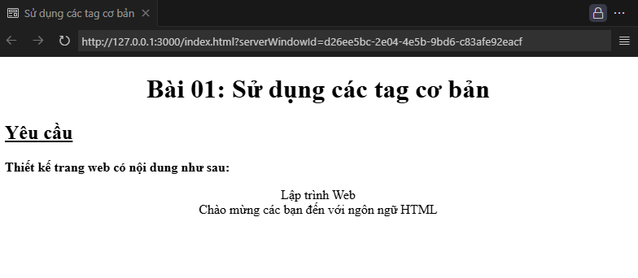

# 🧩 Sử dụng các tag cơ bản

## 🎯 Mục tiêu
Giúp làm quen với các **thẻ HTML cơ bản** và **thuộc tính CSS đơn giản** để định dạng văn bản trên trang web.

---

## 📘 Kiến thức trong bài

### **HTML Tags**

| Thẻ     | Chức năng               |
| ------- | ----------------------- |
| `<h1>`  | 🏷️ Tiêu đề lớn nhất        |
| `<h2>`  | 🏷️ Tiêu đề nhỏ hơn         |
| `<p>`   | 📝 Đoạn văn bản            |
| `<div>` | 📦 Khối nội dung tổng quát |
| `<br>`  | ⬇️ Xuống dòng              |

### **Thuộc tính HTML**

| Thuộc tính | Chức năng                                    |
| ---------- | -------------------------------------------- |
| `align`    | ↔️ Căn chỉnh vị trí nội dung (trái, phải, giữa) |
| `style`    | 🎨 Viết CSS trực tiếp trong thẻ                 |

### **CSS Properties**

| Thuộc tính        | Chức năng                     |
| ----------------- | ----------------------------- |
| `text-decoration` | ➖ Gạch chân, gạch ngang, v.v. |
| `font-weight`     | 💪 Độ đậm của chữ (normal, bold) |
| `text-align`      | ↔️ Căn chỉnh vị trí văn bản      |

---

## 🧠 Bài tập



### **Yêu cầu:**

| STT | Đối tượng      | Yêu cầu                                    | Ghi chú                                                              |
| --- | -------------- | ------------------------------------------ | -------------------------------------------------------------------- |
| 1   | Trang web      | 🖥️ Tiêu đề cửa sổ: **Sử dụng các tag cơ bản** | Sử dụng `<title>`                                                    |
| 2   | Nội dung trang | 🔹 Dòng 1: canh giữa                          | `<h1 align="center">` hoặc `style="text-align:center"`               |
|     |                | ✏️ Dòng 2: gạch chân                          | `<h2 style="text-decoration:underline">`                             |
|     |                | 💪 Dòng 3: in đậm                             | `<p style="font-weight:bold">` hoặc `<div style="font-weight:bold">` |
|     |                | 🎯 Dòng 4: canh giữa và xuống dòng            | `<p style="text-align:center"><br/></p>`                             |

---

## 🧩 Hướng dẫn từng bước

| STT | Đối tượng | Cách thực hiện                                    | Mã minh họa                                                                     |
| --- | --------- | ------------------------------------------------- | ------------------------------------------------------------------------------- |
| 1   | Trang web | 🖥️ Thêm tiêu đề cho tab trình duyệt                  | `<title>Sử dụng các tag cơ bản</title>`                                         |
| 2   | Dòng 1    | 🔹 Sử dụng `<h1>` để hiển thị tiêu đề lớn, canh giữa | `<h1 align="center">Đây là tiêu đề</h1>`                                        |
| 3   | Dòng 2    | ✏️ Dùng `<h2>` với gạch chân                         | `<h2 style="text-decoration:underline;">Đây là dòng gạch chân</h2>`             |
| 4   | Dòng 3    | 💪 Dùng `<p>` hoặc `<div>` để in đậm                 | `<p style="font-weight:bold;">Đây là dòng in đậm</p>`                           |
| 5   | Dòng 4    | 🎯 Căn giữa và xuống dòng                            | `<div style="text-align:center;">Đây là dòng canh giữa<br/>và xuống dòng</div>` |

---

## 🧩 Tham khảo

<details>
<summary>💻 Xem mã HTML mẫu</summary>

```html
<h1 align="center">Bài 01: Sử dụng các tag cơ bản</h1>
<h2 style="text-decoration: underline">Yêu cầu</h2>
<p style="font-weight: bold">Thiết kế trang web có nội dung như sau:</p>
<p align="center">Lập trình Web<br />Chào mừng các bạn đến với ngôn ngữ HTML</p>
```
</details>

✍️ **Người soạn:** _Phạm Xuân Hoài_ <br />
📚 **Chủ đề:** HTML cơ bản - Bài học số: 01
