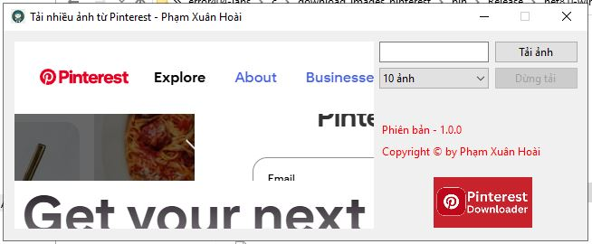

# 📸 Pinterest Image Downloader

Ứng dụng **Pinterest Image Downloader** cho phép tải nhanh nhiều ảnh từ Pinterest theo từ khóa.  
Hỗ trợ tải **tối đa 100 ảnh cùng lúc** chỉ với một thao tác đơn giản.  

---

## 🚀 Tính năng
- 🔎 Tìm ảnh theo **keyword** trên Pinterest.  
- 📥 Tải về **hàng loạt ảnh** (lên tới 100 ảnh).  
- ⚡ Nhanh chóng, đơn giản, dễ sử dụng.  
- 🛠️ Xây dựng bằng **C# (.NET)**, chạy trên **Visual Studio 2022**.  

---

## 🛠️ Yêu cầu hệ thống
- **Visual Studio 2022** (khuyên dùng bản mới nhất).  
- **.NET 6.0/7.0/8.0** (nên dùng phiên bản mới để build/publish).  
- Windows 10/11.  

---

## 📦 Cách sử dụng
1. Clone project:
   ```bash
   download src: https://github.com/kitajima2910/error404-labs/tree/master/c/download_images_pinterest
   ```
2. Mở solution bằng Visual Studio 2022.

3. Chọn Build → Publish để tạo file .exe.

4. Chạy tool, nhập keyword → chọn số lượng ảnh → Download.

## 📸 Demo
<p align="center">
  
</p>

## 👨‍💻 Tác giả

Phạm Xuân Hoài – R&D Programmer

## 📜 License

MIT License – Tự do sử dụng và chỉnh sửa.