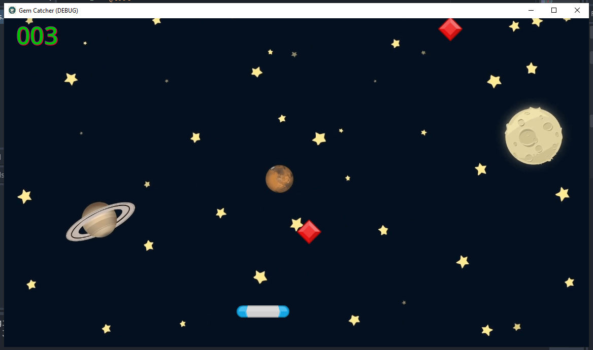

# 💎 Gem Catcher – Godot 4.4 (Basic Project)

Một game mini cơ bản được phát triển bằng **Godot Engine 4.4**.  
Nhiệm vụ của bạn là **di chuyển giá đỡ** để bắt những viên ngọc rơi xuống và đạt điểm cao nhất!  

---

## 🎮 Gameplay

- Người chơi điều khiển nhân vật bằng **A-D**.  
- Ngọc rơi ngẫu nhiên từ phía trên.  
- Mỗi viên ngọc bắt được sẽ cộng **+1 điểm**.  
- Nếu để ngọc rơi xuống đất, bạn sẽ **kết thúc trò chơi**.

---

## 📸 Screenshot
<p align="center">
  
</p>

## 🛠️ Công nghệ sử dụng
- **Godot Engine 4.4**
- GDScript
- Scene System: Node2D, Sprite2D, Label, CollisionShape2D, RigidBody2D, ...

---

## 🚀 Cách chạy project

1. Tải Godot 4.4 từ [Godot Official Website](https://godotengine.org/download).
2. Clone repository này:
   ```bash
   download: https://github.com/kitajima2910/error404-labs/tree/master/game/jumpstart-to-2d-game-development-godot-4-for-beginners/GemCatcher
   ```
3. Mở Godot, chọn Import Project → trỏ tới folder vừa tải xuống.

4. Chạy game bằng nút ▶ Play.

## 🎯 Mục tiêu học tập

Dự án này dành cho beginner học Godot:

Làm quen với scene & node system.

Hiểu cách viết script đơn giản với GDScript.

Tạo logic cơ bản: spawn item, tính điểm, xử lý va chạm.

Quản lý game loop: Start → Playing → Game Over.

## 👨‍💻 Tác giả

Phạm Xuân Hoài – R&D Programmer

📌 Chia sẻ kiến thức về Game Development, Web, Mobile & AI

## ⭐ Ghi chú

Nếu thấy dự án này hữu ích, hãy ⭐ Star repo để ủng hộ nhé!