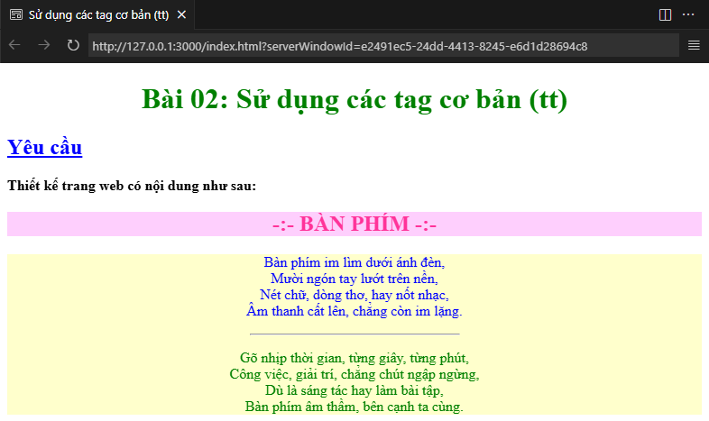

# 🧩 Sử dụng các tag cơ bản (tt)

## 🎯 Mục tiêu

Giúp **hiểu sâu hơn** về cách kết hợp **thẻ HTML** với **thuộc tính CSS** để tạo bố cục và trình bày trang web sinh động, có màu sắc, căn chỉnh và hiệu ứng trực quan hơn.

---

## 📘 Kiến thức trong bài

### **HTML Tags mở rộng**

| Thẻ           | Chức năng                                |
| ------------- | ---------------------------------------- |
| `<hr>`        | ➖ Tạo đường kẻ ngang phân cách nội dung |
| `<div>`       | 📦 Chia khối, nhóm nội dung riêng biệt   |
| `<br>`        | ⬇️ Xuống dòng trong đoạn văn             |
| `<p>`         | 📝 Viết đoạn văn, chứa văn bản chính     |
| `<h1> - <h2>` | 🏷️ Tiêu đề chính và tiêu đề phụ          |

### **Thuộc tính HTML - CSS kết hợp**

| Thuộc tính         | Chức năng / Giá trị ví dụ                         |
| ------------------ | ------------------------------------------------- |
| `align`            | ↔️ Căn chỉnh nội dung (`left`, `center`, `right`) |
| `style`            | 🎨 Ghi CSS trực tiếp trong thẻ                    |
| `color`            | 🎨 Màu chữ (`green`, `#ff3399`, `blue`, v.v.)     |
| `background-color` | 🖌️ Màu nền của khối hoặc văn bản                  |
| `font-weight`      | 💪 Độ đậm của chữ (`normal`, `bold`)              |
| `text-decoration`  | ➖ Gạch chân, gạch ngang (`underline`)            |
| `width`            | 📦 Chiều dài (`30%`)                              |

---

## 🧠 Bài tập



### **Yêu cầu:**

| STT | Đối tượng         | Yêu cầu mô tả                                                           | Ghi chú                                                                                     |
| --- | ----------------- | ----------------------------------------------------------------------- | ------------------------------------------------------------------------------------------- |
| 1   | Trang web         | 🖥️ Tiêu đề cửa sổ: **Sử dụng các tag cơ bản (tt)**                      | Sử dụng thẻ `<title>`                                                                       |
| 2   | Dòng tiêu đề 1    | 💚 Tiêu đề chính căn giữa, màu **xanh lá**                              | `<h1 align="center" style="color: green">`                                                  |
| 3   | Dòng tiêu đề 2    | 🔵 Tiêu đề phụ “Yêu cầu” gạch chân, màu **xanh dương**                  | `<h2 style="text-decoration: underline; color: #0000ff;">`                                  |
| 4   | Đoạn mô tả        | 💪 Dòng in đậm: “Thiết kế trang web có nội dung như sau”                | `<p style="font-weight: bold;">`                                                            |
| 5   | Tiêu đề khối thơ  | 🎨 Nền **hồng nhạt**, chữ **hồng đậm**, căn giữa, in đậm                | `<h2 align="center" style="background-color: #fecffd; color: #ff3399; font-weight: bold;">` |
| 6   | Khối nội dung thơ | 📦 Nền **vàng nhạt**, gồm 2 đoạn thơ khác màu, có đường kẻ ngang ở giữa | Dùng `<div align="center" style="background-color:#ffffcc">` và `<hr>`                      |
| 7   | Đoạn thơ 1        | 🔹 Màu chữ **xanh dương**, có xuống dòng giữa các câu                   | `<p style="color: blue;">...</p>`                                                           |
| 8   | Đoạn thơ 2        | 🟢 Màu chữ **xanh lá cây**, cách đoạn trên bằng đường kẻ                | `<p style="color: green;">...</p>`                                                          |

---

## 🧩 Hướng dẫn từng bước

| STT | Bước                   | Cách thực hiện                                       | Mã minh họa                                                                                                 |
| --- | ---------------------- | ---------------------------------------------------- | ----------------------------------------------------------------------------------------------------------- |
| 1   | Thêm tiêu đề cho trang | Dùng thẻ `<title>` trong phần `<head>`               | `<title>Sử dụng các tag cơ bản (tt)</title>`                                                                |
| 2   | Tạo tiêu đề chính      | Dùng `<h1 align="center" style="color: green">`      | `<h1 align="center" style="color: green">Bài 02: Sử dụng các tag cơ bản (tt)</h1>`                          |
| 3   | Tạo tiêu đề phụ        | Dùng `<h2>` gạch chân, màu xanh dương                | `<h2 style="text-decoration: underline; color: #0000ff;">Yêu cầu</h2>`                                      |
| 4   | Viết dòng mô tả        | Sử dụng `<p>` và thuộc tính `font-weight:bold`       | `<p style="font-weight: bold;">Thiết kế trang web có nội dung như sau:</p>`                                 |
| 5   | Tạo khối thơ           | Dùng `<h2>` nền hồng, chữ hồng đậm, canh giữa        | `<h2 align="center" style="background-color:#fecffd;color:#ff3399;font-weight:bold;">-:- BÀN PHÍM -:-</h2>` |
| 6   | Tạo phần nền chứa thơ  | Dùng `<div>` nền vàng nhạt, canh giữa                | `<div align="center" style="background-color:#ffffcc">...</div>`                                            |
| 7   | Thêm đoạn thơ 1        | Dùng `<p>` màu xanh dương, ngắt dòng bằng `<br/>`    | `<p style="color:blue">Bàn phím im lìm dưới ánh đèn,<br/>Mười ngón tay...</p>`                              |
| 8   | Thêm đường kẻ          | Dùng `<hr style="width:30%;">` để phân chia nội dung | `<hr style="width:30%">`                                                                                    |
| 9   | Thêm đoạn thơ 2        | Dùng `<p>` màu xanh lá cây, ngắt dòng tương tự       | `<p style="color:green">Gõ nhịp thời gian, từng giây...</p>`                                                |

---

## 🧩 Tham khảo

<details>
<summary>💻 Xem mã HTML mẫu</summary>

```html
<!DOCTYPE html>
<html lang="vi">
    <head>
        <meta charset="UTF-8" />
        <meta name="viewport" content="width=device-width, initial-scale=1.0" />
        <title>Sử dụng các tag cơ bản (tt)</title>
    </head>
    <body>
        <h1 align="center" style="color: green">
            Bài 02: Sử dụng các tag cơ bản (tt)
        </h1>
        <h2 style="text-decoration: underline; color: #0000ff">Yêu cầu</h2>
        <p style="font-weight: bold">Thiết kế trang web có nội dung như sau:</p>
        <h2
            align="center"
            style="background-color: #fecffd; color: #ff3399; font-weight: bold"
        >
            -:- BÀN PHÍM -:-
        </h2>
        <div align="center" style="background-color: #ffffcc">
            <p style="color: blue">
                Bàn phím im lìm dưới ánh đèn,<br />
                Mười ngón tay lướt trên nền,<br />
                Nét chữ, dòng thơ, hay nốt nhạc,<br />
                Âm thanh cất lên, chẳng còn im lặng.
            </p>
            <hr style="width: 30%" />
            <p style="color: green">
                Gõ nhịp thời gian, từng giây, từng phút,<br />
                Công việc, giải trí, chẳng chút ngập ngừng,<br />
                Dù là sáng tác hay làm bài tập,<br />
                Bàn phím âm thầm, bên cạnh ta cùng.
            </p>
        </div>
    </body>
</html>
```

</details>

---

✍️ **Người soạn:** _Phạm Xuân Hoài_ <br />
📚 **Chủ đề:** HTML cơ bản
