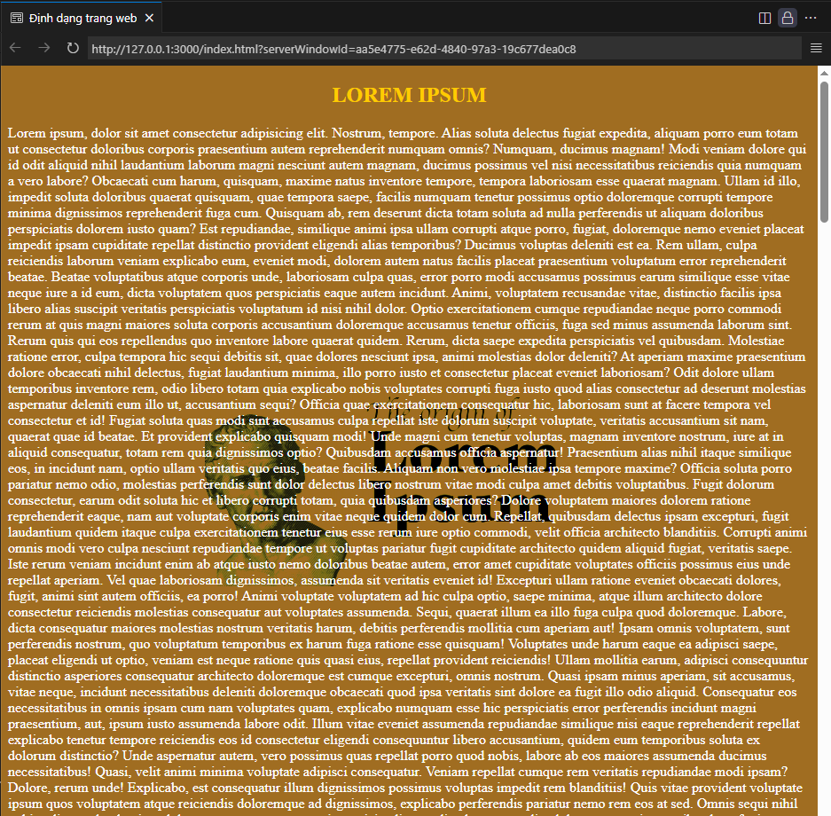

# 🎨 Định dạng trang web

## 🎯 Mục tiêu

Giúp làm quen với các **thuộc tính CSS nâng cao** để định dạng trang web, bao gồm màu sắc, hình nền, chữ viết và hiệu ứng hình ảnh.

---

## 📘 Kiến thức trong bài

### **HTML Tags**

| Thẻ      | Chức năng              |
| -------- | ---------------------- |
| `<h2>`   | 🏷️ Tiêu đề cấp 2       |
| `<span>` | 📝 Phần văn bản inline |
| `<body>` | 📄 Thân trang web      |

### **CSS Properties cho Background**

| Thuộc tính              | Chức năng                               |
| ----------------------- | --------------------------------------- |
| `background-color`      | 🎨 Màu nền                              |
| `background-image`      | 🖼️ Hình ảnh nền                         |
| `background-position`   | 📍 Vị trí hình nền                      |
| `background-repeat`     | 🔄 Lặp lại hình nền                     |
| `background-attachment` | 📌 Cố định hình nền khi cuộn            |
| `background-size`       | 📏 Kích thước hình nền                  |
| `background-blend-mode` | 🎭 Chế độ pha trộn màu nền với hình nền |

### **CSS Properties cho Text**

| Thuộc tính       | Chức năng                            |
| ---------------- | ------------------------------------ |
| `color`          | 🎨 Màu chữ                           |
| `text-transform` | 🔠 Chuyển đổi kiểu chữ (hoa, thường) |

---

## 🧠 Bài tập



### **Yêu cầu:**

| STT | Đối tượng | Yêu cầu mô tả                              | Ghi chú                                      |
| --- | --------- | ------------------------------------------ | -------------------------------------------- |
| 1   | Trang web | 🖥️ Tiêu đề cửa sổ: **Định dạng trang web** | Sử dụng thẻ `<title>`                        |
| 2   | Body      | 🎨 Màu nền: `#a06d21`, màu chữ: `#fff`     | `background-color` và `color`                |
| 3   | Body      | 🖼️ Hình nền: `lorem-ipsum.png`             | `background-image: url('./lorem-ipsum.png')` |
| 4   | Body      | 📍 Căn giữa hình nền, không lặp lại        | `center center`, `no-repeat`                 |
| 5   | Body      | 📌 Cố định hình nền, kích thước 50%        | `fixed`, `50%`                               |
| 6   | Body      | 🎭 Hiệu ứng làm tối hình nền               | `background-blend-mode: darken`              |
| 7   | Tiêu đề   | 🔠 In hoa, màu vàng `#ffcc00`, căn giữa    | `uppercase`, `color`, `align="center"`       |
| 8   | Nội dung  | 📝 Văn bản Lorem Ipsum dài (lorem5000)     | Sử dụng thẻ `<span>`                         |

---

## 🧩 Hướng dẫn từng bước

| STT | Bước                     | Cách thực hiện                                        | Mã minh họa                                                              |
| --- | ------------------------ | ----------------------------------------------------- | ------------------------------------------------------------------------ |
| 1   | Thêm tiêu đề trang       | Sử dụng thẻ `<title>` trong phần `<head>`             | `<title>Định dạng trang web</title>`                                     |
| 2   | Đặt màu nền và màu chữ   | Dùng `background-color` và `color` trong thẻ `<body>` | `style="background-color: #a06d21; color: #fff;"`                        |
| 3   | Thêm hình nền            | Dùng `background-image` với đường dẫn file            | `background-image: url('./lorem-ipsum.png');`                            |
| 4   | Cấu hình vị trí hình nền | Dùng `background-position`, `background-repeat`       | `background-position: center center; background-repeat: no-repeat;`      |
| 5   | Cố định và resize hình   | Dùng `background-attachment` và `background-size`     | `background-attachment: fixed; background-size: 50%;`                    |
| 6   | Thêm hiệu ứng blend      | Dùng `background-blend-mode`                          | `background-blend-mode: darken;`                                         |
| 7   | Định dạng tiêu đề        | Dùng `<h2>` với `text-transform`, `color`, `align`    | `<h2 align="center" style="color: #ffcc00; text-transform: uppercase;">` |
| 8   | Thêm nội dung văn bản    | Dùng `<span>` để chứa văn bản                         | `<span>Lorem ipsum...</span>`                                            |

---

## 🧩 Tham khảo

<details>
<summary>💻 Xem mã HTML mẫu</summary>

```html
<!DOCTYPE html>
<html lang="vi">
    <head>
        <meta charset="UTF-8" />
        <meta name="viewport" content="width=device-width, initial-scale=1.0" />
        <title>Định dạng trang web</title>
    </head>
    <body
        style="
            background-color: #a06d21;
            color: #fff;
            background-image: url('./lorem-ipsum.png');
            background-position: center center;
            background-repeat: no-repeat;
            background-attachment: fixed;
            background-size: 50%;
            background-blend-mode: darken;
        "
    >
        <h2 align="center" style="color: #ffcc00; text-transform: uppercase">
            Lorem Ipsum
        </h2>
        <span>
            Lorem ipsum, dolor sit amet consectetur adipisicing elit...
        </span>
    </body>
</html>
```

</details>

---

✍️ **Người soạn:** _Phạm Xuân Hoài_ <br />
📚 **Chủ đề:** HTML cơ bản - CSS Background & Text Formatting
