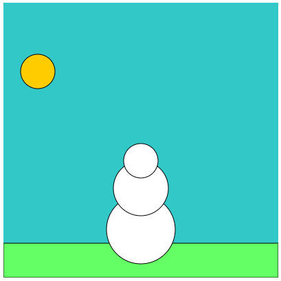

# 🎨 Thử thách: Vẽ ngày trời nắng và có tuyết

## 🧩 Giới thiệu

Trong bài học này, bạn sẽ **tập sử dụng các lệnh `background()`, `ellipse()`, `fill()`, và `rect()`** để **tô màu cho bức tranh người tuyết trong ngày nắng** ☀️.  
Hãy làm từng bước, và quan sát cách mỗi lệnh ảnh hưởng đến hình vẽ của bạn nhé!

## 📚 Mục tiêu học tập

-   Biết cách thay đổi màu nền bằng `background()`.
-   Hiểu cách tô màu cho từng phần bằng `fill()`.
-   Biết thứ tự thực hiện lệnh quan trọng như thế nào trong việc hiển thị màu sắc.

## 📷 Ví dụ minh họa

