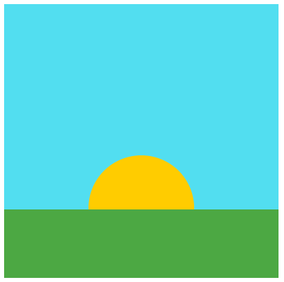

# ☀️ Thử thách: Mặt Trời Chiếu Sáng

## 📌 Mục tiêu

- Mô phỏng mặt trời từ từ lớn dần và tỏa sáng trên đường chân trời
- Biết cách tạo canvas, vẽ hình ellipse (mặt trời) và hình chữ nhật (mặt đất).
- Hiệu ứng đơn giản: mặt trời lớn dần theo thời gian.

---

```html
<!DOCTYPE html>
<html lang="en">
    <head>
        <meta charset="UTF-8" />
        <meta name="viewport" content="width=device-width, initial-scale=1.0" />
        <title>Thử thách: Mặt trời chiếu sáng</title>
    </head>
    <body>
        <script src="https://cdnjs.cloudflare.com/ajax/libs/p5.js/2.0.5/p5.min.js"></script>
        <script>
            var sunSize;

            function setup() {
                createCanvas(400, 400);
                noStroke();

                sunSize = 30;
            }

            function draw() {
                background(82, 222, 240);

                // The sun, a little circle on the horizon
                fill(255, 204, 0);
                ellipse(200, 298, sunSize, sunSize);

                // The land, blocking half of the sun
                fill(76, 168, 67);
                rect(0, 300, 400, 100);

                sunSize++;
            }
        </script>
    </body>
</html>
```

## 📷 Ví dụ minh họa



---
