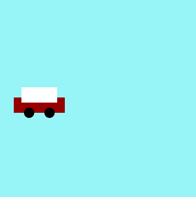

# 🚕 Thử thách: Làm cho xe taxi chạy qua lại

## 📌 Mục tiêu

-   Vẽ chiếc xe taxi đơn giản bằng các hình cơ bản (rect, ellipse).
-   Lập trình cho xe tự động chạy qua lại trên màn hình, và đổi hướng khi chạm cạnh.

---

```html
<!DOCTYPE html>
<html lang="en">
    <head>
        <meta charset="UTF-8" />
        <meta name="viewport" content="width=device-width, initial-scale=1.0" />
        <title>Thử thách: Làm cho xe taxi chạy qua lại</title>
    </head>
    <body>
        <script src="https://cdnjs.cloudflare.com/ajax/libs/p5.js/2.0.5/p5.min.js"></script>
        <script>
            var taxiX;
            var speed;

            function setup() {
                createCanvas(400, 400);
                noStroke();

                taxiX = 0;
                speed = 1;
            }

            function draw() {
                background(151, 244, 247);

                // Vẽ xe taxi
                fill(150, 0, 0);
                rect(taxiX, 200, 100, 30); // Thân xe

                fill(0);
                ellipse(taxiX + 70, 230, 20); // Bánh xe trước
                ellipse(taxiX + 30, 230, 20); // Bánh xe sau

                fill(255);
                rect(taxiX + 15, 180, 70, 30); // Cabin xe

                if (taxiX + 100 > width || taxiX < 0) {
                    speed = -speed;
                }

                taxiX += speed;
            }
        </script>
    </body>
</html>
```

## 📷 Ví dụ minh họa



---

#### ✅ Giải thích từng phần

###### 🎨 1. Thiết lập khung vẽ

```js
function setup() {
    createCanvas(400, 400); // Tạo canvas 400x400
    noStroke(); // Bỏ viền các hình
}
```

###### 🚗 2. Vẽ chiếc xe taxi

```js
// Vẽ xe taxi
fill(150, 0, 0);
rect(taxiX + 50, 200, 100, 30); // Thân xe

fill(0);
ellipse(taxiX + 80, 230, 20); // Bánh xe trước
ellipse(taxiX + 120, 230, 20); // Bánh xe sau

fill(255);
rect(taxiX + 65, 180, 70, 30); // Cabin xe
```

###### 🔁 3. Cho xe di chuyển qua lại

```js
if (taxiX + 100 > width || taxiX < 0) {
    speed = -speed;
}

taxiX += speed;
```
