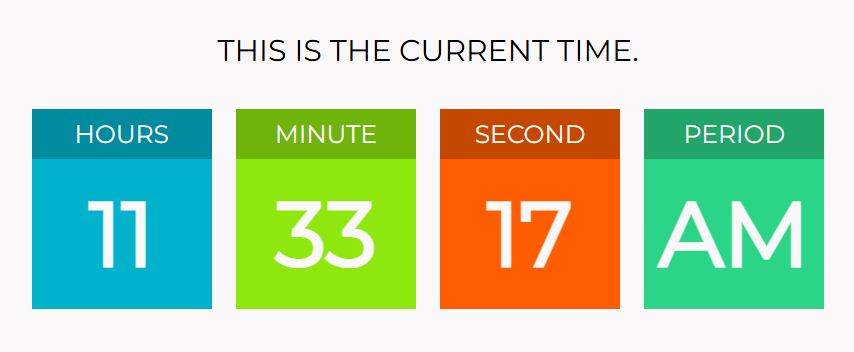

# ⏰ Digital Clock

Một chiếc **đồng hồ kỹ thuật số** đơn giản được xây dựng bằng **HTML, CSS, và JavaScript thuần**.  
Project này phù hợp cho người mới học web, hoặc để nhúng vào website cá nhân.

---

## ✨ Tính năng

- ✅ Hiển thị **giờ, phút, giây** theo thời gian thực
- ✅ Tự động cập nhật mỗi giây
- ✅ Giao diện tối giản, dễ đọc
- ✅ Dễ dàng tuỳ chỉnh màu sắc và font chữ

---

## 📸 Screenshot

  

---

## 🛠️ Công nghệ sử dụng

- **HTML5**: Cấu trúc giao diện
- **CSS3**: Tạo style đồng hồ
- **JavaScript (Vanilla JS)**: Cập nhật thời gian

---

## 👨‍💻 Tác giả

Phạm Xuân Hoài – R&D Programmer\
📌 Web/Game/Mobile/AI Developer
