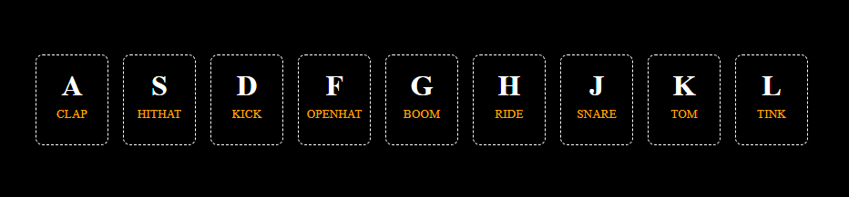

# 🥁 Drum Kit

Một ứng dụng **bộ trống ảo** viết bằng **HTML, CSS và JavaScript thuần**.  
Người dùng có thể chơi nhạc bằng cách **nhấn phím trên bàn phím** hoặc **click chuột** vào các nút trống.

---

## ✨ Tính năng

- ✅ Chơi trống bằng bàn phím (A, S, D, F, G, H, J, K, L)
- ✅ Click chuột vào các nút để phát âm thanh
- ✅ Hiệu ứng nhấn phím và animation khi phát nhạc
- ✅ Dễ mở rộng và thêm âm thanh mới

---

## 📸 Screenshot

  

---

## 🛠️ Công nghệ sử dụng

- **HTML5**: Tạo bố cục giao diện
- **CSS3**: Hiệu ứng và style
- **JavaScript (Vanilla JS)**: Xử lý sự kiện và phát âm thanh

---

## 👨‍💻 Tác giả

Phạm Xuân Hoài – R&D Programmer\
📌 Web/Game/Mobile/AI Developer
